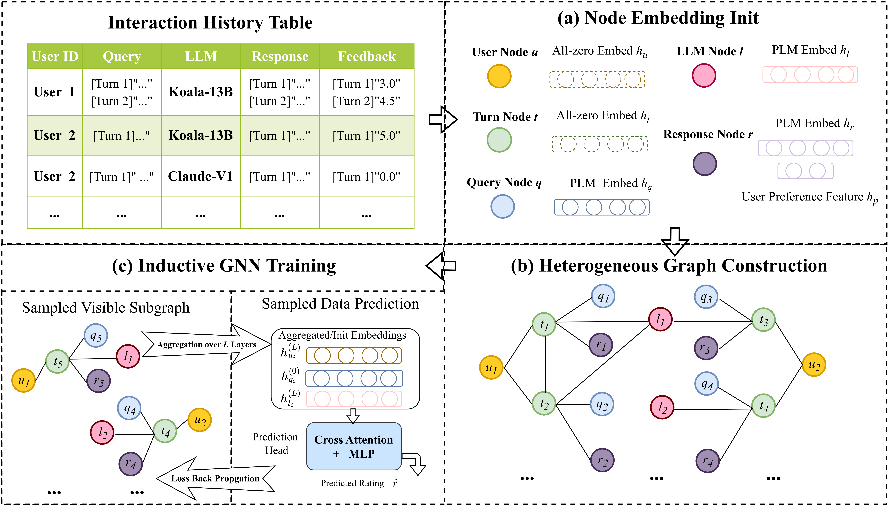

# GMTRouter: Personalized LLM Router Over Multi-turn User Interactions

<p align="center">
    <a href="https://ulab-uiuc.github.io/GMTRouter/">
        
    </a>
    <!-- <a href=>
        
    </a> -->
    <a href="https://github.com/ulab-uiuc/GMTRouter/blob/master/LICENSE">
        
    </a>
    <br>
    <a href="https://github.com/ulab-uiuc/GMTRouter">
        
    </a>
    <a href="https://github.com/ulab-uiuc/GMTRouter">
        
    </a>
    <a href="https://github.com/ulab-uiuc/GMTRouter">
        
    </a>
</p>


<p align="center">
    <a href="https://ulab-uiuc.github.io/GMTRouter/">🌐 Project Page</a> |
    <a href=>📜 arXiv</a> 
<p>


<!--  -->

<div align="center">
  
</div>


## News
**[2025.10.24]** 🌟 The **GMTRouter** paper is now available on arXiv: [url]


## 📌Preliminary

### Environment Setup

We recommend creating a separate conda environment for GMTRouter to avoid dependency conflicts.

```bash
# 1️⃣ Create a new conda environment with Python 3.11
conda create -n GMTRouter python=3.11.13
conda activate GMTRouter

# 2️⃣ Install PyTorch for your GPU version.
# Here we provide a GPU setup for CUDA 12.4.
# If you use a different CUDA version or CPU, please modify accordingly.
pip install torch==2.6.* torchvision==0.21.* torchaudio==2.6.* --index-url https://download.pytorch.org/whl/cu124

# 3️⃣ Install other required Python packages
pip install -r requirements.txt

# 4️⃣ Install PyTorch Geometric (PyG) and related libraries
# This ensures compatibility with PyTorch 2.6 and CUDA 12.4
pip install torch-geometric==2.6.1
````

**Notes / Tips:**

* Make sure your CUDA driver version matches the PyTorch CUDA version you install. Mismatched versions can cause runtime errors.
* If you only want a CPU setup, you can remove the `--index-url` or choose the CPU-specific wheels from PyTorch’s website.
* `requirements.txt` contains standard dependencies; `requirements-gpu-cu124.txt` is tailored for GPU with CUDA 12.4.


### Dataset Preparation

The processed datasets used in our experiments are already hosted in this repository via **Git LFS**.  
They have been unified into a consistent format and split into **training**, **validation**, and **test** sets.

You can obtain the data in two ways:

**Option 1 — Clone directly via Git:**

The datasets will be automatically downloaded via Git LFS during cloning.

**Option 2 — Download manually from Google Drive:**

You can also download the dataset archive directly from the following link:
[Download from Google Drive](https://drive.google.com/uc?export=download&id=1l-sAXV7i08S9sjJw1_UyvD0mP56QSIKt)

After downloading, decompress the archive **`GMTRouter_dataset.tar.gz`** and move the contents of the extracted **`data`** folder into the repository’s **`data/`** directory:

```bash
tar -xzvf GMTRouter_dataset.tar.gz
mv GMTRouter_dataset/data/* ./data/
```


## ⭐Experiments

We provide a sample configuration file at **`./configs/sample.yaml`**,  
where you can specify which dataset to run experiments on.  
Supported datasets include:

- `chatbot_arena`
- `gsm8k`
- `mmlu`
- `mt_bench`

To launch an experiment, run the following command, **replacing `<YAML>` with your own configuration file**:

```bash
python -u ./src/train.py --config ./configs/<YAML>
````

For example:

```bash
python -u ./src/train.py --config ./configs/sample.yaml
```

Each configuration file defines dataset selection, training hyperparameters, and model settings.
You can modify it to fit your own experimental setup or dataset.


## Citation

```bibtex
@inproceedings{Xie2025GMTRouter,
  title={GMTRouter: Personalized LLM Router Over Multi-turn User Interactions},
  author={Xie, Encheng and Sun, Yihang and Feng, Tao and You, Jiaxuan},
  year={2025}
}
```


<!-- <picture>
<source media="(prefers-color-scheme: dark)" srcset="https://api.star-history.com/svg?repos=ulab-uiuc%2FGraphEval&theme=dark&type=Date">

</picture> -->
